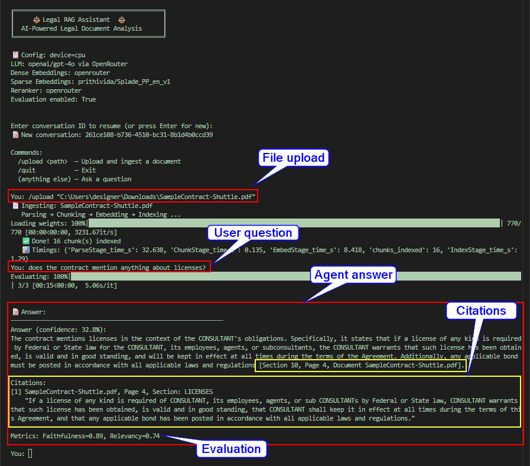
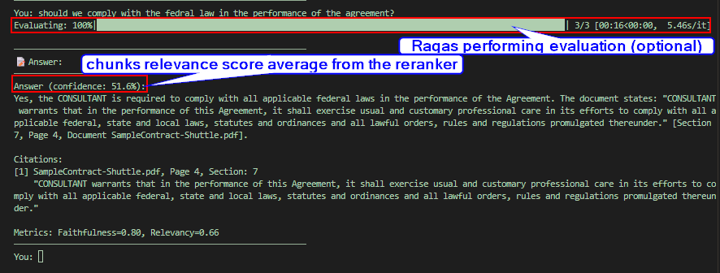
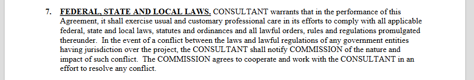

# Legal RAG Assistant ⚖️

An agent-driven Retrieval-Augmented Generation (RAG) system specialized for legal document analysis.

The architecture is designed to handle the strict requirements of legal texts:

- Preserving document hierarchy (headings, clauses, articles)
- Ensuring exact lexical recall of legal terms
- Enforcing strict citation-backed generation to prevent hallucinations
- Providing options to run components locally as much as possible for privacy purposes.

The entire RAG pipeline is encapsulated as a tool and orchestrated by a Conversational Agent with session memory to allow for multi-turn conversations and conversations continuity after closing and reopening the application.

---

## Architecture Overview

The system is split into three core RAG pipelines (Ingestion, Retrieval, Generation) which are consumed by a Conversational Agent.

Each pipeline stage was carefully designed to handle the requirements of dealing with legal texts.

The core idea is:

1. **Ingest** legal documents (PDF/DOCX) → extract text → chunk → embed → store in a vector database.
2. At **query time**, embed the user's question → retrieve the most relevant chunks → pass them as context to the LLM → generate a grounded answer with citations.

### 1. Ingestion Pipeline

Legal documents require structural understanding; simple character-splitting destroys the context of clauses and sections.

- **Parser (`Docling`)**: We use IBM's Docling for layout-aware parsing. It extracts text while preserving document structure and hierarchy (headings, lists). For performance purposes, heavy OCR and neural table models are disabled by default.
- **Chunker (`HybridChunker`)**: A structure-aware chunking strategy that respects document boundaries. It contextualizes chunks by prepending their parent headings, ensuring that isolated clauses retain their section context. It uses token-aware splitting aligned with the downstream embedding model to avoid truncation of important text due to context window overflow. This chunking startegy allows us to enrich chunks with metadata (page, headers, sections...) for citations purposes.
- **Embedder**: Uses a Hybrid approach.
  - **Dense**: OpenAI's `text-embedding-3-large` (via OpenRouter) captures semantic meaning.
  - **Sparse**: `SPLADE++` (running locally via FastEmbed) captures exact lexical terms, which is critical for legal jargon where exact keyword matching is necessary.
- **Indexer (`Qdrant`)**: A local vector database storing dense vectors, sparse vectors, and rich chunk metadata (page numbers, section IDs) for later citations with RRF (Reciprocal Rank Fusion) merging.

### 2. Retrieval Pipeline

Legal queries vary wildly—from requesting a specific clause to asking for a broad comparison.

- **Query Router**: Uses an LLM (e.g., `gpt-4o-mini`) to classify queries into `SIMPLE`, `COMPLEX`, `SPECIFIC`, or `AMBIGUOUS`.
- **Query Transformer**: Depending on the classification, it applies a transformation strategy:
  - *Decomposition*: Breaks down complex comparison questions.
  - *HyDE (Hypothetical Document Embeddings)*: Generates a hypothetical legal clause for broad queries as answer-space embeddings align better with chunk embeddings than question-space embeddings do.
  - *Direct*: Passes simple queries as-is.
- **Hybrid Retriever**: Executes Qdrant's native prefetch using both Dense and Sparse vectors, fused natively using Reciprocal Rank Fusion (RRF).
- **Reranker**: Uses `cohere/rerank-v3.5` (via OpenRouter) or a local Cross-Encoder. A high-precision reranking pass is crucial in legal context to filter out tangentially related clauses.
- **Context Builder**: Formats the final context string, explicitly injecting chunks metadata (Document, Section, Page) to facilitate citations.

### 3. Generation Pipeline

Answers must be strictly grounded and reliably cited.

- **Generator**: Uses LangChain's `with_structured_output` (e.g., `gpt-4o` via OpenRouter) to enforce a rigid `LegalAnswerSchema`. It guarantees the output includes the answer, exact quoted text, caveats, and structured citations.
- **Faithfulness Guard**: An optional evaluation step using the **RAGAS** framework. It calculates `faithfulness`, `answer_relevancy`, and `context_precision` scores to flag and highlight unsupported claims for the user.

### 4. Agent Wrapper

- **Conversational Agent**: Built with **LangChain**, a ReAct agent handles the user conversation. It maintains state across sessions using SQLite (`SqliteSaver`). The entire RAG architecture is exposed to this agent as a single tool (`ask_legal_rag_pipeline`). This allows the agent to handle casual conversation directly while deferring to the highly-structured RAG tool for actual legal analysis.

---

## Design Decisions: Why this Architecture?

1. **Why not just standard LangChain RAG?**
   Standard recursive character splitting destroys legal clauses. If a section heading is chunked separately from its contents, the content becomes orphaned and loses semantic meaning. `Docling` + `HybridChunker` ensures structural boundaries are respected.
2. **Why Hybrid Search (Dense + Sparse)?**
   Dense embeddings are great for "What happens if a party goes bankrupt?". Sparse embeddings (SPLADE) are required for "What is the definition of *Force Majeure* in Section 4.1?" where exact keyword matches matter.
3. **Why Structured Generation?**
   Prompting an LLM to "cite your sources" often results in inconsistent formatting. By forcing the LLM to output a Pydantic schema (`LegalAnswerSchema`), we guarantee that every factual claim is paired with its exact source document and quote.
4. **Why wrap RAG in an Agent?**
   Users often have follow-up questions ("What does that mean in simple terms?") or conversational pleasantries ("Hello!"). An agent can handle the conversation naturally while routing strict document-retrieval tasks to the RAG tool, keeping the RAG pipeline highly specialized and focused on accuracy.

---

## Project Structure

```text
root/
├── config/
│   ├── init.py
│   └── settings.py              # Central config (env vars, device, model names, API keys)
│
├── core/
│   ├── init.py
│   ├── models.py                # Data classes (Chunk, ChunkMetadata, Citation, LegalAnswer, etc.)
│   ├── pipeline.py              # Pipeline Pattern base class for the RAG pipelines
│   ├── exceptions.py            # Custom exceptions
│   ├── memory.py                # Persistence and session management 
│   └── qdrant_client_manager.py # Qdrant client management for vector & sparse indices 
│
├── ingestion/                   # === INGESTION PIPELINE ===
│   ├── init.py
│   ├── parser.py                # Document parsing (Docling + Factory)
│   ├── chunker.py               # Chunking strategy (HybridChunker wrapper)
│   ├── embedder.py              # Dense + Sparse embedding (FastEmbed)
│   ├── indexer.py               # Qdrant storage/indexing
│   └── pipeline.py              # Ingestion pipeline orchestration
│
├── retrieval/                   # === RETRIEVAL PIPELINE ===
│   ├── init.py
│   ├── query_router.py          # Query classification & routing
│   ├── query_transformer.py     # HyDE, decomposition
│   ├── retriever.py             # Hybrid retrieval (dense + sparse + RRF)
│   ├── reranker.py              # Cross-encoder reranking
│   ├── context_builder.py       # Retrieved context assembly
│   └── pipeline.py              # Retrieval pipeline orchestration
│
├── generation/                  # === GENERATION PIPELINE ===
│   ├── init.py
│   ├── llm_client.py            # OpenRouter LLM wrapper
│   ├── prompt_templates.py      # System/user prompts for legal QA
│   ├── generator.py             # LLM generation with structured output
│   ├── faithfulness_guard.py    # Post-generation evaluation using RAGAS (optional)
│   └── pipeline.py              # Generation pipeline orchestration
│
├── evaluation/                  # ======= EVALUATION ========
│   ├── init.py
│   └── ragas_eval.py            # RAGAS-based evaluation
│
├── utils/
│   ├── init.py
│   └── logging.py               # Structured logging setup
│
├── sample docs/                 # Sample documents for testing (PDF, DOCX)
│
├── main.py                      # CLI entry point
├── .env.example                 # Configuration template
└── requirements.txt             # All dependencies
```

---

## Setup & Installation

### Prerequisites

- Python <=3.11
- An [OpenRouter](https://openrouter.ai/) account (for LLMs, Embeddings, and Reranking)

### Installation

1. **Clone the repository and navigate to the project directory:**

   ```bash
   git clone <repository_url>
   cd "Legal RAG Assistant"
   ```

1. **Create a virtual environment and install dependencies:**

   ```bash
   py -3.11 -m venv .venv
   .venv\Scripts\activate (on windows)
   pip install -r requirements.txt
   ```

1. **Configure the Environment:**
   Copy the example environment file and add your API keys:

   ```bash
   cp .env.example .env
   ```

   Edit `.env` to include your OpenRouter API key and choose your configurations:

   ```ini
   OPENROUTER_API_KEY=your_openrouter_api_key_here
   ```

### Running the Assistant

Start the interactive CLI:

```bash
python main.py
```

**Available Commands within the CLI:**

- `/upload <path>` — Upload and ingest a legal document (PDF/DOCX). Example: `/upload "contract.pdf"`
- `/quit` — Exit the application.
- *(Any other input)* — Chat with the agent or ask a legal question.

---

### Optional Configurations (Local vs. Remote)

The assistant is highly configurable via the `.env` file, allowing you to run mostly locally (for better privacy) or connect to remote APIs (for better performance).

#### 1. Embeddings (`EMBEDDING_PROVIDER`)

- **`local`**: Runs FastEmbed/ONNX locally on your CPU/GPU. No API keys required.
  - *Dense Default*: `BAAI/bge-large-en-v1.5`
  - *Sparse Default*: `prithivida/Splade_PP_en_v1`
- **`openrouter`**: Uses OpenRouter's `/v1/embeddings` endpoint for dense embeddings, while still using the local SPLADE++ for sparse embeddings.
  - *Dense Default*: `openai/text-embedding-3-large`

#### 2. Rerankers (`RERANKER_PROVIDER`)

- **`local`**: Runs a cross-encoder locally using sentence-transformers.
  - *Default*: `BAAI/bge-reranker-base` (or `-large`)
- **`openrouter`**: Uses OpenRouter's rerank API for higher precision.
  - *Default*: `cohere/rerank-v3.5`

#### 3. LLMs (Generation & Query Routing)

LLMs are currently configured to use OpenRouter.

- **`LLM_MODEL`**: The primary model used for structured generation and answering (e.g., `openai/gpt-4o`).
- **`LLM_MODEL_SMALL`**: A faster, cheaper model used for routing and classification tasks (e.g., `openai/gpt-4o-mini`).

You can easily switch between these options by modifying the `.env` file before starting the application.

---

## Sample Usage

- Example 1:

    

  - Truth & Quote:

     

- Example 2:

    

  - Truth & Quote:

     
